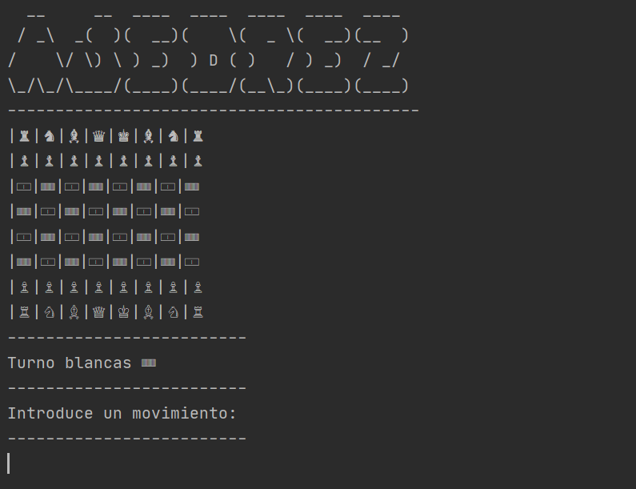

# ♟ chess

> A shell embeded PvP chess game written in Java from scratch



---

## :wrench: BASIC INSTRUCTIONS

Download the source code, compile it and run it. In order for it to work you must have previously installed JDK:
``` bash
javac *.java #basic functionalities
java Main #advance features such as texture handling and more!
``` 
If you are working in Windows you have to define the enviroment variables to map the java.exe and javac.exe directory.

---

## 🎨 OPTIONS

The chess board is displayed like follows:

| Tables        | Are           | Cool  |
| ------------- |:-------------:| -----:|
| col 3 is      | right-aligned | $1600 |
| col 2 is      | centered      |   $12 |
| zebra stripes | are neat      |    $1 |
